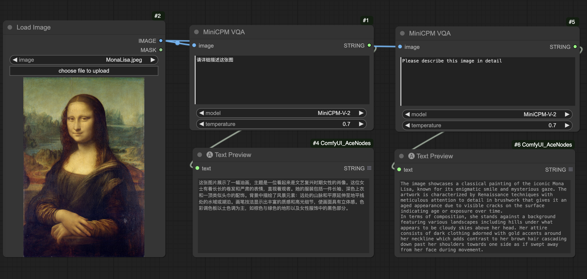

# ComfyUI MiniCPM-V (Unofficial Support)

Unofficial [MiniCPM-V](https://github.com/OpenBMB/MiniCPM-V) support for [ComfyUI](https://github.com/comfyanonymous/ComfyUI).

## Important Updates
- **2024/05/22:** Added support for MiniCPM-Llama3-V 2.5
- **2024/04/18:** Added ComfyUI nodes and workflow examples

## Basic Workflow
This [workflow](examples/workflow.json) shows the basic usage on querying an image with Chinese and English.

 

## Installation
- Install from ComfyUI Manager (search for `minicpm`)

- Download or git clone this repository into the ComfyUI/custom_nodes/ directory and run:
```
pip install -r requirements.txt
```

## Download Checkpoints
All the models will be downloaded automatically, no worries.